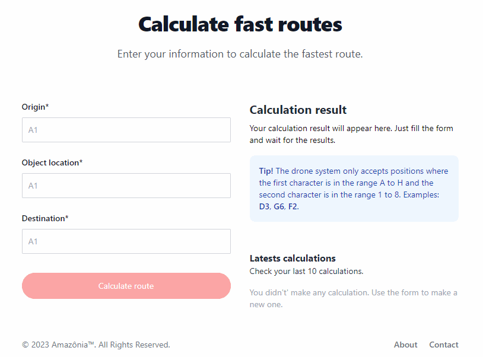

# Amazônia Project


## Description

A dynamic web application for **Amazônia**, a fictional brand created in a technological challenge promoted by the company [**Ateliware**](https://ateliware.com).

The objective of the challenge is to develop a web application
responsible for calculate the **fastest** delivery route for a drone system.

## Challenge

The challenge is to create a solution for a drone system, which must navigate a map to make quick deliveries. The drone must calculate from 3 positions entered by the user.

Starting from a list of positions and a travel time between them, similar to a chessboard. The system must be able to calculate the fastest route using only bidirectional movements. The solution to this was based on [Dijkstra's algorithm](https://en.wikipedia.org/wiki/Dijkstra%27s_algorithm) and can be found [here](https://github.com/rrxs/amazonia-app/blob/main/backend/src/utils/calculationFunctions.ts).

The system first uses the function to calculate the distance and path between the origin point and the object's position and then repeats the process from the object's position to the final destination.

For example, if the user wants to calculate the fastest path with the data.

- Origin: **C2**
- Object: **G2**
- Destination: **H1**

The system should return:

Path: **C2**-C3-D3-E3-F3-F2-**G2**-G1-**H1** \
Travel time: 135 seconds


## Technologies Used

- Angular v16
- Tailwind CSS
- Typescript v5
- NestJs v10
- Node.js v18
- AWS EC2

## Live Demo

You can see the application live at [Live demo](http://ec2-54-221-95-15.compute-1.amazonaws.com/)

## Features

- Users can calculate the fastest route providing a origin, object location and a destination.
- Users can see a list of last 10 calculations.
- Form validation using Angular Reactive forms.
- Full responsive using Tailwind CSS.
- Unit tests.
- e2e tests.

## Preview



## Folder structure

```text
    root
    │
    ├── backend
    │   ├── src
    │   │   ├── controllers
    │   │   ├── models
    │   │   ├── services
    │   │   └── utils
    │   └── test (e2e tests)
    │
    ├── frontend
    │   └── src
    │       ├── app
    │       │   ├── components
    │       │   ├── models
    │       │   ├── pages
    │       │   ├── services
    │       │   └── utils
    │       ├── assets
    │       └── environments
    │
    │
    ├── docker-compose.prod.yml
    └── docker-compose.yml
```

## Running locally

First clone the repository.

```shell
git clone https://github.com/rrxs/amazonia-app.git
cd amazonia-app
```

You can run the application using **docker** or build and run manually.

### Using Docker

Run `docker-compose up`. Navigate to `http://localhost:8081/`.

### Build and run

#### Prerequisites

[Node v18](https://nodejs.org/en)

#### Backend

Find more details [here](https://github.com/rrxs/amazonia-app/tree/main/backend).

```shell
# navigate to backend folder
cd backend

# install all dependencies
npm install

# run
npm run start
```

The server should be running on port `8080`.

#### Frontend

Find more details [here](https://github.com/rrxs/amazonia-app/tree/main/frontend).

In another terminal.

```shell
# navigate to frontend folder
cd frontend

# install all dependencies
npm install

# run
npm run start
```

Once started you can view the application by opening `http://localhost:4200` in your browser.
